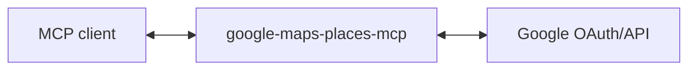

# google-maps-places-mcp

MCP server for Google Maps Places API - search for places and get photos.

## Use Cases

**Meeting coordination**: Someone emails "Let's meet at Nando's near the office - what time works best for you?" → your AI assistant looks up the location, checks opening hours, and adds it to your calendar with the address.

**Local recommendations**: Ask "find a quiet café with WiFi near King's Cross for a 2-hour work session" → get places with ratings, hours, and photos to help you decide.

**Address validation**: Confirm or autocomplete partial addresses before sending mail or booking deliveries.

(These are just examples - any workflow that needs place search or business info can use this.)

## Setup

### 1. Create Google OAuth credentials

1. Go to [Google Cloud Console](https://console.cloud.google.com/)
2. Create a new project (or use existing)
3. Enable the **Places API (New)**
4. Go to **APIs & Services** → **OAuth consent screen**, set up consent screen
5. Go to **APIs & Services** → **Credentials** → **Create Credentials** → **OAuth client ID**
6. Choose **Web application**
7. Add `http://localhost:3000/callback` to **Authorized redirect URIs**
8. Note your Client ID and Client Secret

### 2. Run the server

```bash
GOOGLE_CLIENT_ID='your-client-id' \
GOOGLE_CLIENT_SECRET='your-client-secret' \
MCP_TRANSPORT=http \
npm start
```

The server runs on `http://localhost:3000` by default. Change with `PORT=3001`.

### 3. Add to your MCP client

```bash
claude mcp add --transport http google-maps-places-mcp http://localhost:3000/mcp
```

## Architecture

This server acts as an **OAuth proxy** to Google:



1. Server advertises itself as an OAuth authorization server via `/.well-known/oauth-authorization-server`
2. `/register` returns the Google OAuth client credentials
3. `/authorize` redirects to Google, encoding the client's callback URL in state
4. `/callback` receives the code from Google and forwards to the client's callback
5. `/token` proxies token requests to Google, injecting client credentials
6. `/mcp` handles MCP requests, using the bearer token to call Places API

The server holds no tokens or state - it just proxies OAuth to Google.

## Tools

| Tool | Description |
|------|-------------|
| `places_text_search` | Search for places by text query (e.g., "coffee shops near me") |
| `places_photo_get` | Get a photo URL for a place |

## OAuth Scope

- `cloud-platform` - Access to Google Cloud APIs (required for Places API New)

## Contributing

Pull requests are welcomed on GitHub! To get started:

1. Install Git and Node.js
2. Clone the repository
3. Install dependencies with `npm install`
4. Run `npm run test` to run tests
5. Build with `npm run build`

## Releases

Versions follow the [semantic versioning spec](https://semver.org/).

To release:

1. Use `npm version <major | minor | patch>` to bump the version
2. Run `git push --follow-tags` to push with tags
3. Wait for GitHub Actions to publish to the NPM registry.
